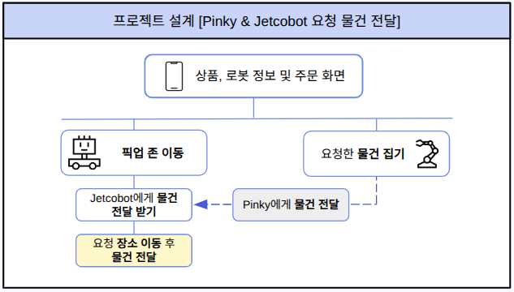
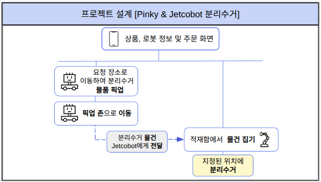
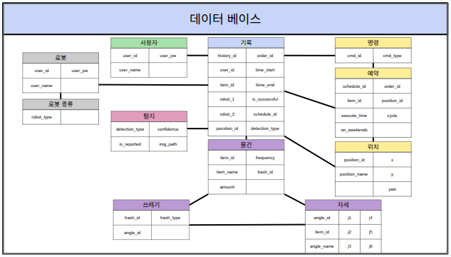
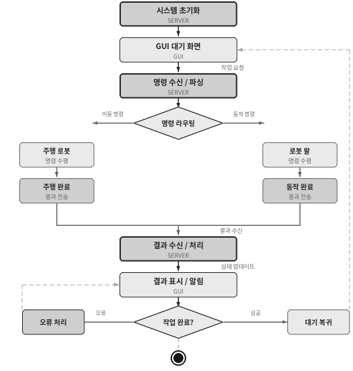
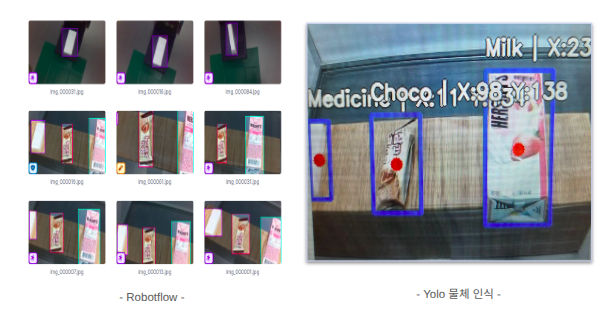
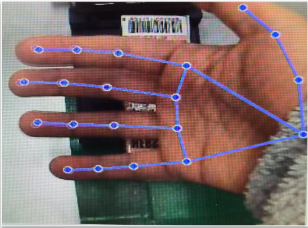
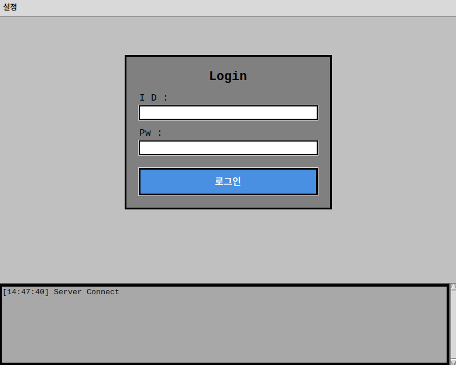
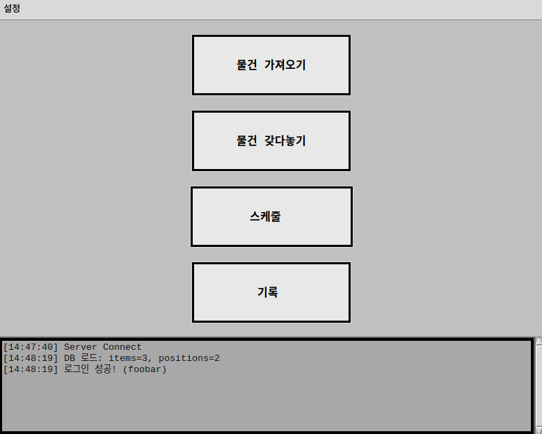
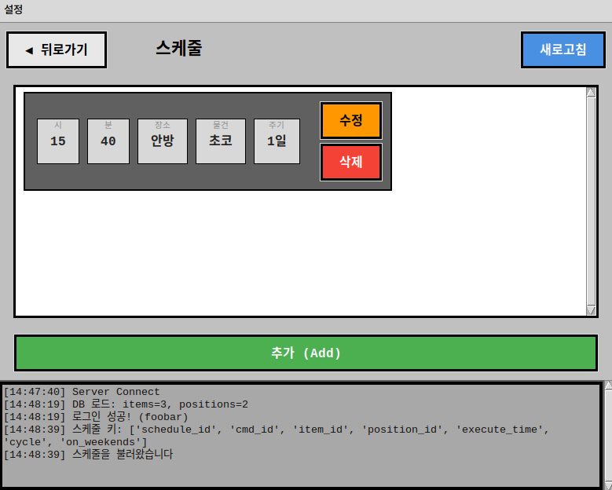

# roscamp-repo-3

ROS2와 AI를 활용한 자율주행 로봇개발자 부트캠프 3팀 저장소. 인공지능 휴먼케어 자동 로봇 프로젝트 (AI Automated Human Care Robot Project)

## Table of Contents

- [Development Environments](#development-environments)
- [Requirements](#requirements)
- [Scenario](#scenario)
- [Database](#database)
- [Server](#server)
- [AI](#ai)
- [GUI](#gui)

---

## Development Environments

| Division     | Environments                                                                                                                                                                                                                                                                                                                    |
| ------------ | ------------------------------------------------------------------------------------------------------------------------------------------------------------------------------------------------------------------------------------------------------------------------------------------------------------------------------- |
| **개발환경** |  |
| **Editor** |   |
| **언어** |  |
| **UI** |  |
| **Server** |   |
| **AI** |    |
| **자율주행** |   |
| **협업** |    |

---

## Requirements

#### User Requirements

| UR_ID | UR Description                                               | Priority | Reporter |
| ----- | ------------------------------------------------------------ | -------- | -------- |
| UR_01 | 사용자가 원하는 물건을 가져올 수 있어야 한다                 | R        | -        |
| UR_02 | 사용자가 버리고 싶은 쓰레기를 받아서 처리할 수 있어야 한다   | R        | -        |
| UR_03 | 주행 로봇은 정해진 시간에 지정된 약을 사용자에게 가져다준다  | R        | -        |
| UR_04 | 사람의 위급상황을 감지해서 관련기관에 신고 할 수 있어야 한다 | R        | -        |
| UR_05 | 로봇은 주기적으로 청소를 할 수 있어야 한다                   | R        | -        |
| UR_06 | 사용자는 로봇들의 현재 상태를 알 수 있어야 한다              | R        | -        |
| UR_07 | 사용자가 주행 로봇을 직접 조종할 수 있어야 한다              | R        | -        |
| UR_08 | 로봇은 장애물을 인식하고 회피할 수 있어야 한다               | R        | -        |
| UR_09 | 로봇은 사람의 얼굴을 구분 할 수 있어야 한다                  | R        | -        |
| UR_10 | 로봇팔은 행동구간의 장애물을 인식하고 정지 할 수 있어야 한다 | R        | -        |
| UR_11 | 사용자가 원하는 위치에 물건을 적재할 수 있어야 한다          | R        | -        |

---

#### System Requirements

| SR_ID | SR Name               | SR Description                                                                                                                                | Priority | Reporter | UR ID         |
| ----- | --------------------- | --------------------------------------------------------------------------------------------------------------------------------------------- | -------- | -------- | ------------- |
| UR_01 | 물품 관리 기능        | 소유자는 물품의 다음 항목을 등록/수정/삭제 할 수 있어야 한다                                                                                  | R        | -        | UR_01, 02, 03 |
| UR_02 | 물품 요청 기능        | 소유자가 요청한 물건을 로봇팔이 선반에서 집어 주행로봇에게 전달하고 지정된 위치로 배달 할 수 있어야 한다                                      | R        | -        |               |
| UR_03 | 물건 요청 취소 기능   | 소유자가 배달을 취소할 경우 배달의 역순으로 주행로봇이 로봇팔에게 전달하고 로봇팔은 물건의 선반 원래 위치에 놓을 수 있어야 한다               | R        | -        |               |
| UR_04 | 픽업존 진입           | 주행로봇은 픽업존의 위치를 인식하고 정확히 진입할 수 있어야 한다                                                                              | R        | -        | UR_01, 02, 03 |
| UR_05 | 물체 파지 판단        | 로봇팔은 그리퍼의 상태와 영상 데이터를 분석하여 물체 파지 성공 여부를 판단한다. 실패 시 2회 재시도                                            | R        | -        | UR_01, 02     |
| UR_06 | 물건 수거 인식        | 주행 로봇은 지점에 도착 후 물건 수거하는것을 카메라로 인식하고 판단할 수 있어야 한다                                                          | R        | -        | UR_01, 02, 03 |
| UR_07 | 작업 수행 결과 판단   | 주어진 작업의 성공 또는 실패를 판단하고 사용자에게 알릴 수 있어야한다                                                                         | R        | -        |               |
| UR_08 | 분리수거 기능         | 소유자가 주행로봇을 이용해서 전달한 쓰레기를 로봇팔이 인식하고 분리수거 할 수 있어야 한다.                                                    | R        | -        | UR_02         |
| UR_09 | 작업 스케줄 관리      | 소유자는 로봇이 수행할 다음 작업을 예약/수정/취소할 수 있다                                                                                   | R        | -        | UR_03, 04, 05 |
| UR_10 | 자동 청소             | 로봇은 주기적으로 집안 청소를 수행한다                                                                                                        | R        | -        | UR_05         |
| UR_11 | 자동 충전             | 주행로봇은 작업이 없거나 배터리가 30% 미만일 경우 스스로 충전독을 찾아가 충전 할 수 있어야 한다                                               | R        | -        | UR_06         |
| UR_12 | 로봇간 충돌 방지      | 주행로봇들은 주행중 현재 좌표를 서버로 전송하고 서버에서 충돌하지 않도록 경로를 정해준다                                                      | R        | -        | UR_06, 08     |
| UR_13 | 안전 거리 유지        | 50cm(데모용) 거리 이내로 동적 장애물(사람, 반려동물 등)이 접근할 경우 주행로봇은 현재 속도의 50%를 감소하고 20 cm 이내로 접근할 경우 정지한다 | R        | -        | UR_08         |
| UR_14 | 주행 로봇 상태 표시   | 주행로봇은 다음 상태를 소유자에게 시각적으로 표시할 수 있어야 한다                                                                            | R        | -        | UR_06         |
| UR_15 | 로봇팔 정지 기능      | 로봇팔은 행동구간에 장애물을 감지하면 자동으로 동작을 멈출 수 있어야 한다                                                                     | R        | -        | UR_10         |
| UR_16 | 로그인                | 등록된 소유자만이 ID/PW를 이용하여 접속 할 수 있어야 한다                                                                                     | R        | -        |               |
| UR_17 | 소유자 정보 관리 기능 | 소유자는 시스템에 등록된 자신의 정보를 등록/수정/삭제 할 수 있어야 한다                                                                       | R        | -        |               |
| UR_18 | 로봇 정보 관리 기능   | 소유자는 시스템에서 로봇의 정보를 등록/수정/삭제 할 수 있어야 한다                                                                            | R        | -        |               |
| UR_19 | 맵 스캔               | 주행로봇은 집안을 자동 또는 수동으로 스캔하여 맵을 생성 한다                                                                                  | R        | -        |               |
| UR_20 | 맵 구성               | 소유자는 생성된 맵에서 선반, 쓰레기통 등의 위치를 지정 또는 수정할 수 있어야 한다                                                             | R        | -        |               |
| UR_21 | 로봇 모니터링 기능    | 소유자는 시스템의 상태를 앱에서 확인을 할 수 있어야 한다.                                                                                     | R        | -        | UR_06         |
| UR_22 | 알람 기능             | 다음 상황에 소유자에게 알람을 보낸다. 1.위급상황 2.로봇의 상태                                                                                | R        | -        |               |
| UR_23 | 위급 상황 감지        | 주행로봇에서 수집된 영상 이미지를 서버에서 분석하여 긴급상황이 일어난것을 감지 한다                                                           | R        | -        | UR_04         |
| UR_24 | 로그 기록             | 로봇의 행동 로그를 데이터베이스에 저장해야 한다                                                                                               | R        | -        |               |

---

## Scenario

---
## Database

---

## Server

---

## AI

---

## GUI

---

### Happy Hacking! 🎉
